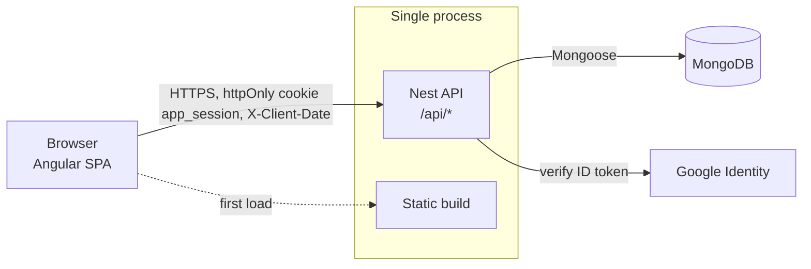
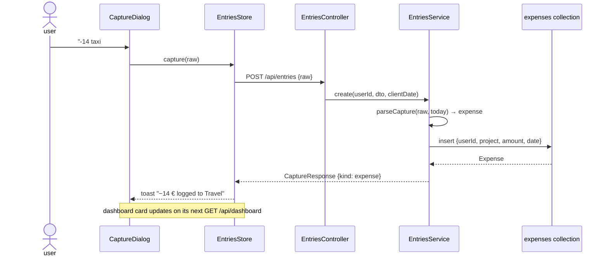
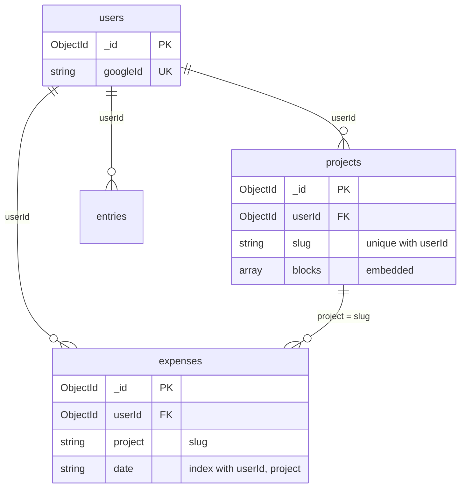

# Templates

Replace names; keep the caps.

## Context / container (`flowchart LR`, ≤12 nodes)

Caption: one sentence. `Files: apps/api/src/main.ts, apps/api/src/auth/auth.guard.ts, apps/api/src/app.module.ts`.

## Request flow (`sequenceDiagram`, ≤8 participants, ≤14 messages)

Caption: what the flow decides, and what it does not do. `Files: …`.

## Storage (`erDiagram`, one entity per collection)

Caption: the ownership rule and how joins work (by slug string, not by id). `Files: apps/api/src/*/*.schema.ts`.
